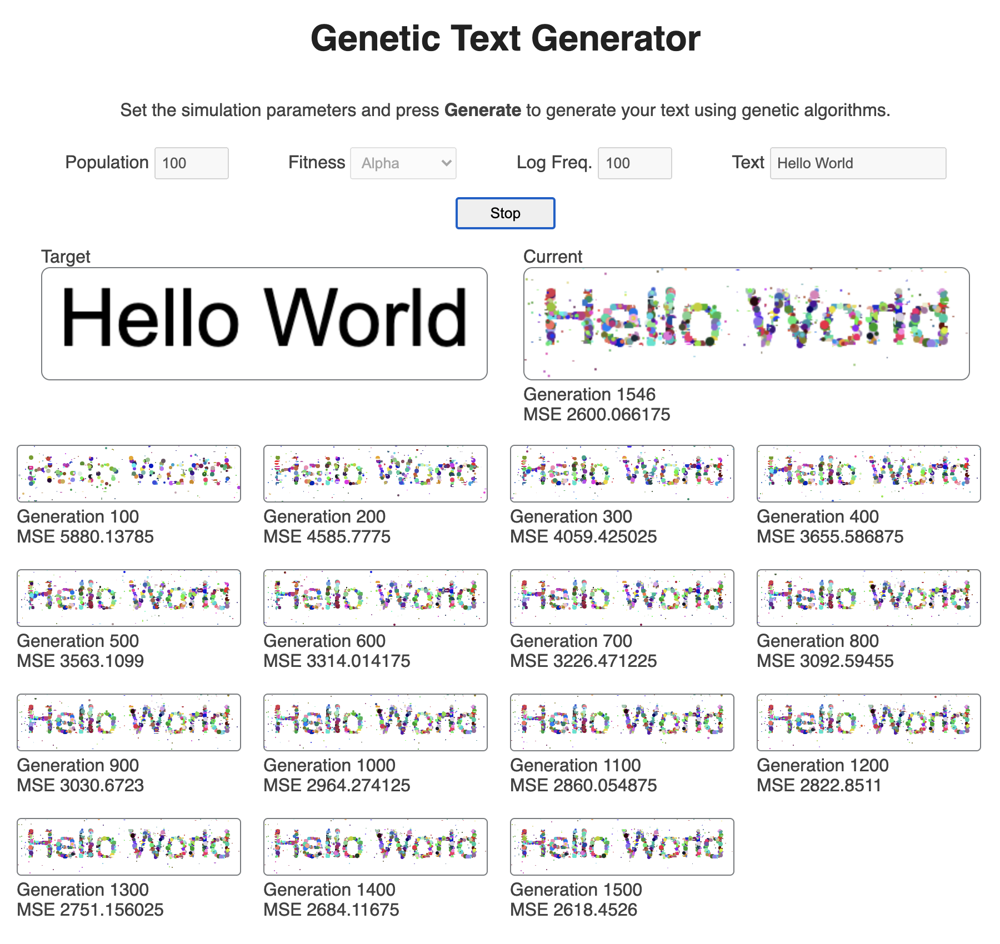

# Generate Text

This repository is part of a Thing-a-Week challenge. This week’s theme is:

> Generate text

Generating text (e.g. via markov chains) is boring, so with some creative
interpretation it became generate an image of text... using a genetic
algorithm.

**Demo:** [tboronczyk.github.io/taw-textgen/src/index.html](https://tboronczyk.github.io/taw-textgen/src/index.html)

---

